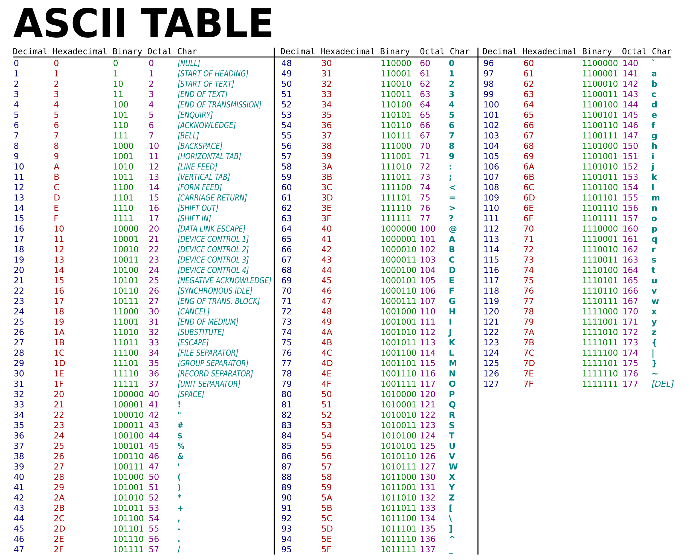
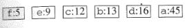
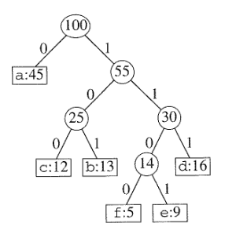
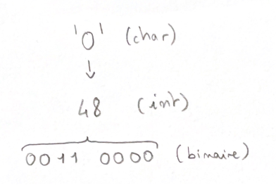
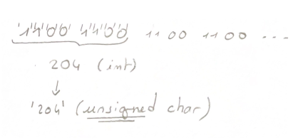

# Compression : Algrorithme de Huffman

## Compilation

```
gcc -Wall main.c fonctions.c fonctions.h -o huffman -lm     (linux)
```
```
gcc -Wall main.c fonctions.c fonctions.h -o huffman         (macos)
```

L'option ```-lm``` est permet de lier la librairie ```<maths.h>``` (qui ne fait pas partie des librairies standards de C) à la compilation.  
- Sur linux, cette option est indispensable,
- Sur mac, elle provoque une erreur de compilation.

## Execution

**Compression :**
```
./huffman -c <fichier_a_compresser> <nom_fichier_sortie>
```

**Decompression :**
```
./huffman -d <fichier_a_decompresser> <nom_fichier_sortie>
```

**Aide :**
```
./huffman -h
```

## Fonctionnement

- **Compression**

Dans un premier temps, le programme ouvre le fichier (en lecture seule) et compte le nombre d'occurrences de chaque caractère (le nombre maximum de caractères est celui de la table ASCII : 128).  
  
En même temps, chaque caractère est associé à son occurrence dans une liste chaînée de maillons (structure contenant entre autres *caractère* et *occurrence*).  
Cette liste est ensuite ordonnée grâce à un algorithme de tri (tri à bulles): pour cela la *liste chainée de maillons* est convertie en un *tableau de maillons* pour des raisons de simplicité.  
  
Ex:  
  
  
Ce tableau permet ensuite la construction d'un *arbre de codage*.  
  
Ex:  
  
  
Cet arbre est placé en en-tête d'un nouveau fichier: c'est un fichier binaire, mais nous avons choisi de ne pas encoder l'en-tête, afin de faciliter la décompression.  
Cet en-tête correspond donc à la somme totale des occurrences (occurrence de la racine), suivi de chaque caractère et son occurrence, tous séparés par un "HORIZONTAL TAB" (n°9 ASCII). L'en-tête se termine par un "VERTICAL TAB" (n°10 ASCII).  
Le fichier source est ensuite lu caractère par caractère et, pour chacun de ces caractères, le programme retrouve sa position dans l'arbre.  
Lorsque la recherche du caractère part vers un *fils gauche* de l'arbre, un **0** est ajouté dans le nouveau fichier, lorsqu'elle part vers un *fils droit*, c'est un **1**.  
On obtient donc un fichier contenant une chaine binaire correspondant au codage d'Huffman du texte source.  
Ici, on observe un problème: placée tel-quelle, la chaîne prend plus de place que le texte original. En effet, chaque caractère (0 ou 1) est codé sur *8 bits* (1 octet) au lieu de ne l'être que sur *1 bit*.  
  
Ex:  
  
  
Un seul caractère prend donc **8** fois plus de place que nécessaire.  
Pour remédier à ce problème nous avons divisé la chaine en paquets de 8 caractères ("bits" placés dans la chaîne), puis converti ces "octets" en entiers (base 10).  
La nouvelle chaîne créée à partir de ces entiers en base 10 peut alors être placée dans le nouveau fichier, et *occuper moins d'espace* que le texte source.  
**Remarque :** Cette nouvelle chaine doit être de type *caractère non signé* afin de ne pas avoir de bit de signe, et ainsi d'éviter les problèmes de dépassement (max: 255 au lieu de 127).  
  
Ex:  
  
  

- **Décompression :**

La première étape est de récupérer l'entête du fichier compressé, et de recréer l'arbre de la même façon qu'à la compression: les séparateurs 9 ("HORIZONTAL TAB") et 10 ("VERTICAL TAB") simplifient la tâche en permettant la distinction entre les caractères et leur occurrence, et le signalement de la fin de l'en-tête.  
Une fois l'arbre reconstruit, on peut récupérer chaque caractère de la chaîne, le convertir en binaire, et parcourir l'arbre selon le "bit" : 0 --> fils gauche, 1 --> fils droit.  
Lorsque la recherche atteint une feuille de l'arbre, elle ajoute le caractère de cette feuille dans un nouveau fichier (le fichier décompressé) et repart à la racine de l'arbre.  
Lorsqu'il n'y a plus de caractère binaire dans la chaine source, la recherche s'arrête et le fichier se ferme.  
  

- **Problème noté :**

Lors de la *compression*, si la chaine binaire (avant découpage en groupes de 8 caractères) n'est pas un multiple de 8, le programme va compléter le dernier groupe avec les '0' manquants pour arriver à l'octet. Ainsi, lors de la *décompression*, il est probable qu'un caractère non désiré soit ajouté en fin de chaine.  
Par exemple, si *'lorem.txt'* est compressé en *'lorem.hzip'*, lors de la décompression de *'lorem.hzip'*, le fichier décompressé (ex: *'lorem_decomp.txt'*) comportera un '**r**' tout à la fin de la chaîne, issu d'un "0000" (quatre zéros) ajouté en bout de cahîne binaire au moment de la décompression.  
  
---
Louis Travaux | Edouard Calzado  
PRE-ING-2